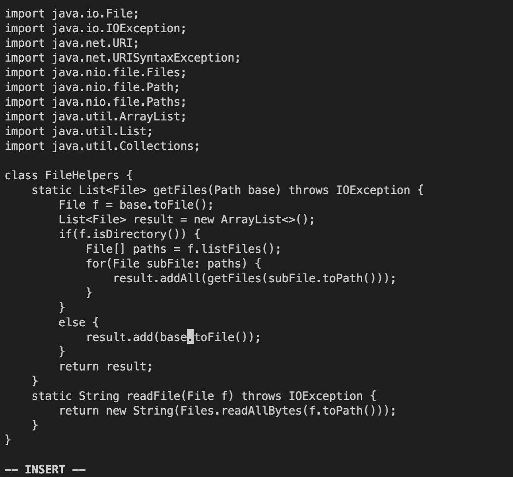

## Part 1

* In order to search for the first "start" word press:
```
<Esc> /start
```


 

* Delete the first "start" word and replace it with "base":

```
dw (placed at the beginng of the word "start")
```

```
base <Esc>
```


* Repeat the previous 2 steps until all the "start" words are changed to "base":


 


  

 

 

* To save the changes:

```
:w <Enter>
```


## Part 2

For the first part it took me 633 seconds and the second part it took me about 411 seconds. 

I would choose the second style if I had to work on a program remotely since I am already logged into a ssh session and the changes are made remotely; instead of doing the changes locally and then copying that file remotely.

However, both styles work the same. A factor that might influence which style I'd choose is if there are too many people collaborating on the project because in that case it would be better if everyone made their changes locally first instead of immediately changing the original file remotely. This would be to avoid complications in everyone making different changes or doing it at the same time. 
 
